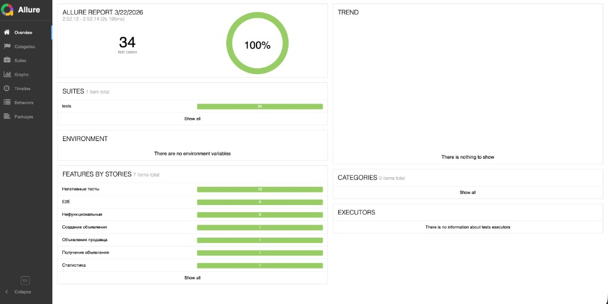

# API тесты для микросервиса объявлений Avito QA Internship

Задание 2.1: Тесты API для микросервиса https://qa-internship.avito.com

## Эндпоинты

| Метод | Путь | Описание |
|-------|------|----------|
| POST | /api/1/item | Создать объявление |
| GET | /api/1/item/{id} | Получить объявление по id |
| GET | /api/1/{sellerId}/item | Получить все объявления продавца |
| GET | /api/1/statistic/{id} | Получить статистику по объявлению |

## Установка зависимостей

```bash
cd QATestAvito  # или путь к проекту
pip install -r requirements.txt
```

Или с использованием venv:

```bash
python -m venv venv
source venv/bin/activate  # Linux/macOS
# или: venv\Scripts\activate  # Windows
pip install -r requirements.txt
```

## Запуск тестов

```bash
# Все тесты
pytest

# С подробным выводом
pytest -v

# Конкретный файл
pytest tests/test_create_item.py -v

# Конкретный тест
pytest tests/test_create_item.py::TestCreateItem::test_create_with_valid_data -v
```

## Allure отчёты (дополнительно)

```bash
# Запуск с сохранением результатов для Allure
pytest --alluredir=allure-results

# Генерация и открытие отчёта (требует allure: brew install allure / scoop install allure)
allure serve allure-results

# Статический отчёт для приложения в решение
allure generate allure-results -o allure-report --clean
```

### Пример отчёта Allure



Скриншот отчёта Allure: 34 теста, 100% passed (создание, получение, E2E, негативные, нефункциональные).

## Настройка

- **Host:** https://qa-internship.avito.com (задан в `api/utils/routes.py`)
- **Сеть:** тесты требуют доступа в интернет к qa-internship.avito.com
- **sellerId:** используется диапазон 111111–999999 для изоляции от других тестировщиков

## Структура (по образцу prodboard-ui)

```
QATestAvito/
├── api/
│   ├── utils/
│   │   ├── client.py   # HTTP-клиент (BaseRequest)
│   │   └── routes.py   # Константы URL
│   ├── data/               # Pydantic-схемы (api/data/item.py, config.py)
│   ├── models/
│   │   └── avito/
│   │       └── item_api.py  # AvitoApiUrls + AvitoItemApi (обёртки над методами)
│   └── api_fixtures.py # Фикстуры pytest
├── tests/
│   ├── test_create_item.py   # Создание объявлений
│   ├── test_get_item.py      # Получение по id
│   ├── test_get_by_seller.py # Получение по продавцу
│   ├── test_statistic.py     # Статистика
│   ├── test_negative.py      # Негативные сценарии
│   ├── test_e2e.py           # E2E сценарии
│   └── test_nonfunctional.py # Нефункциональные проверки
├── conftest.py         # Фикстуры pytest
├── pytest.ini          # Конфигурация pytest
├── pyproject.toml      # Конфиг Ruff, Black
├── requirements.txt
├── TESTCASES.md        # Описание тест-кейсов
├── BUGS.md                   # Найденные дефекты
├── allure-report-screenshot.png  # Скриншот отчёта Allure (пример)
└── postman_collection.json
```

## Линтер и форматтер

Конфигурация в `pyproject.toml` (Ruff, Black).

```bash
pip install ruff black
ruff check api tests
ruff format api tests
# или
black api tests
```
